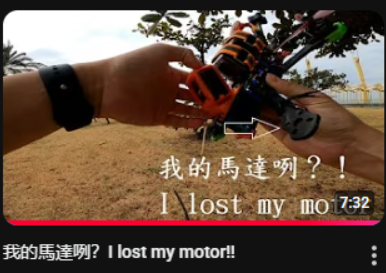

# DroneGuesser_II — solution

---

## Steps

1. **Find the pilot’s socials**
   - Reverse image search the profile picture → locate the **YouTube channel**.

   - Channel content is centered on **FPV drones**.

2. **Locate the relevant footage**
   - Video title: **我的馬達咧？I lost my motor!!**

   - Around **5:48**, crash aftermath shows the drone and **close-ups of the motors**.

3. **Read motor clues from frames**
   - Visible marking: **“2207”** on the bell → **stator size**.
   - Partial letters: **“AE”** on another face.
   - Query: **`AE 2207 FPV motor`** → points to **Axisflying** brand, **2207 V2** line.

4. **Confirm exact model**
   - On Axisflying’s **product page**, multiple KV variants exist.
   - In the **review** section, the video shows the precise unit being installed: **Axisflying 2207 V2 1960KV**.

5. **Get official testing data**
   - Open the **Test report / spec sheet** for **2207 V2 1960KV**.
   - Extract:
     - **Max Thrust**: `1702.7 g`
     - **RPM at Max Thrust**: `31802`

6. **Assemble the flag**
   - `MOTORType` uses the product naming without spaces: **`2207V21960KV`**  
   - Final: `ECW{2207V21960KV_1702.7_31802}`

---

## Result
`ECW{2207V21960KV_1702.7_31802}`