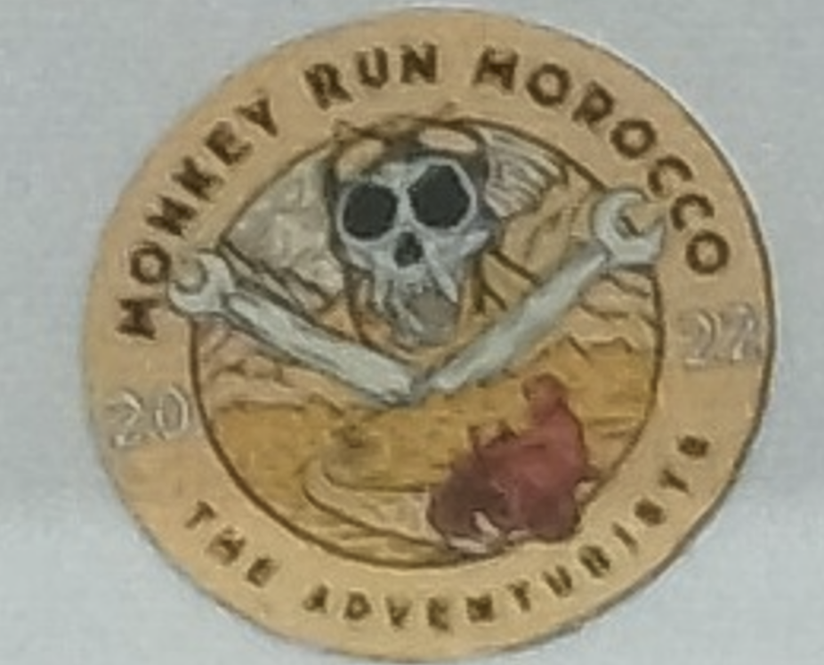
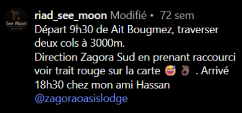
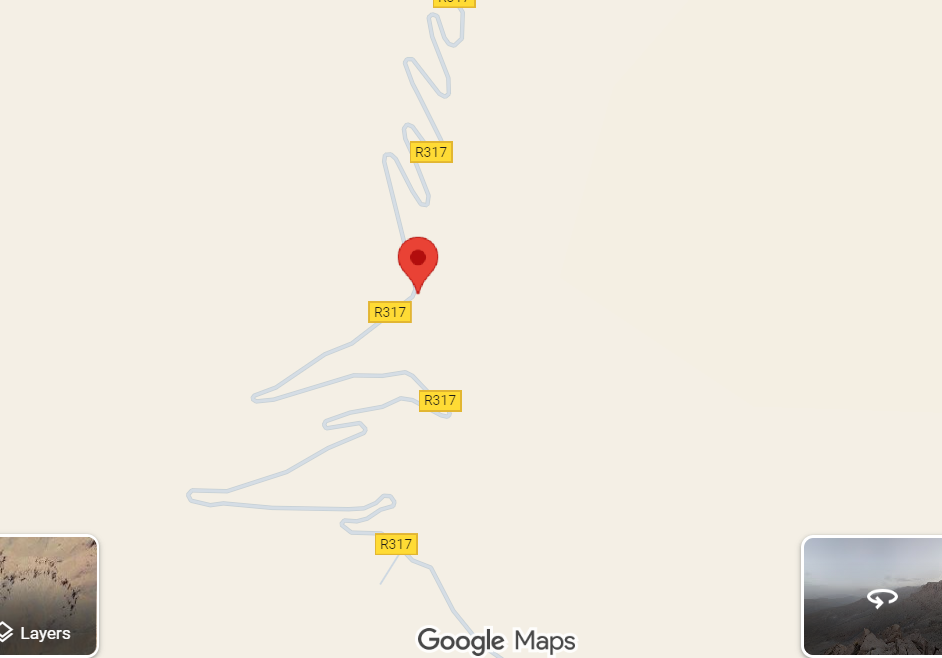

# It’s a Sign — solution

---

## Steps

1. **Extract clues from the sign**
   - Sticker: **“Monkey Run Morocco”** → country hint.

   - Emblem: Moroccan **Ministry of Logistics/Equipment** logo → confirms **Morocco**.

2. **Reverse image search, scoped to Morocco**
   - Results include an **Instagram post** showing the same sign and mentioning **Route 317**, **near Zagora**.

3. **Corroborate with additional imagery**
   - Another photo indicates the sign sits at a **bend** with **powerlines** nearby.

4. **Pinpoint on maps**
   - Scan **Route 317** (Zagora area) for the **bend + powerlines** configuration.
   - Match viewpoint and roadside context → drop a pin at the sign’s location.

5. **Get the Plus Code**
   - Copy the Plus Code for the pinned location: **`8C3MGPPG+RQ`**.

---

## Result
`ECW{8C3MGPPG+RQ}`