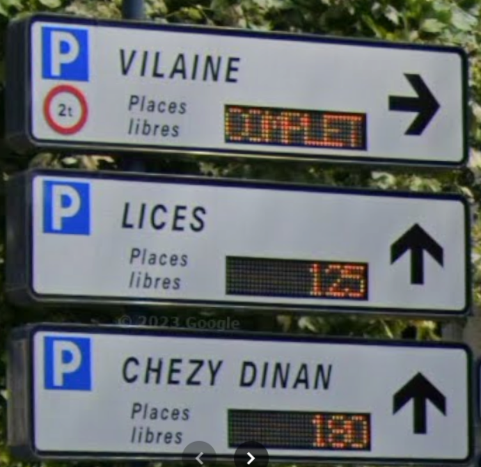
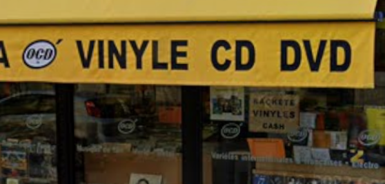
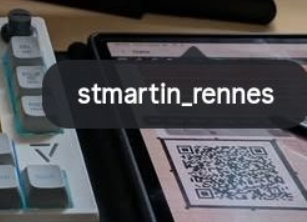
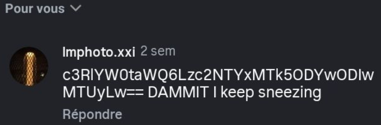
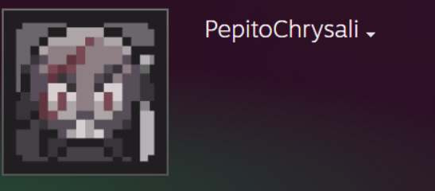
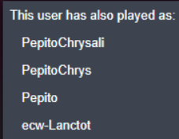

# Jobstacle_II — solution

---

## Part 1 — IP address

**Message from the bot :** 
First, I need you to find the IP address of the suspect. When I was working with the crew, John often told us that he went to explore the departmental archives in his free time.
He left from our hideout near the Ibn Khaldoun mosque, and went northwest to the archives. I think he also always stopped to different pharmacies (for better OPSEC, we think) on the way back but only right after getting cash from a closeby bank.
He needed the stuff for his diabetes I think. Anyway, he left me a notebook with some weird poems ? You might make something of it, here's a transcript.

1 - August 2023 :
Near the road's mount, a tryptich of arrows
One of them on top. Its number will be your first vow.

2 - ebruary 2025 :
At the old bourgeois boulevard lies another clue,
But watch the temperature ! It might get frezeing for you.

3 - [erased] 2023
In a bustling town, where technology is king,
There lies a small shop, for those who need fixing.
Their name has put many at ease.

4 - march 2022
Step into the realm of melodies and scenes,
Where vinyls, CDs, and DVDs reign serene.
A shop with a yellow storefront will be your guide,
The truth lies somewhere inside.

Don't forget meds !!!! 4 pharmas are clean
200, 48.12939945601638, -1.6943130170587877, 48.093306482270535, -1.6520208744113876

Don't forget to feed Rosco`

**Bot intro:** notebook with four dated verses; route: hideout near **Ibn Khaldoun mosque** → **north-west** to departmental archives; 4 “clean” pharmacies; two coordinate pairs:
- Hideout area: **48.12939945601638, -1.6943130170587877**
- Archives: **48.093306482270535, -1.6520208744113876**

Focus search on pharmacies **between those points**. Each verse yields one number:

1) **Aug 2023** — “tryptich of arrows… number on top”  
   Street View (2023) near a pharmacy shows **three arrows** with **125** above → **125**.

   

2) **Feb 2025** — “old bourgeois boulevard… watch the temperature”  
   **Pharmacie Léon Bourgeois** (Bd Léon Bourgeois), Street View **Feb 2025**, sign shows **10 °C** → **10**.

3) **[erased] 2023** — tech repair shop whose **name puts many at ease**  
   Repair shop **Mobile35** (intended: **PC35**) covered in **2023** → **35**.

4) **Mar 2022** — media shop with **yellow storefront**, “truth lies somewhere inside”  
   **O’CD** storefront (Street View **Mar 2022**) shows **2** inside → **2**.

**IP assembled:** `125.10.35.2`

---

## Part 2 — Person of Interest

`Great! Now, I need you to find the name of one of their contacts. They are a key asset in the operation but we dont have much information on them : the only thing we know is that they are linked to a guy named Julien Martinano. This guy has a pretty sparse online presence, on few platforms. One of our interns found he has an Instagram but lost the link (ugh). Maybe they are childhood friends of sorts from the Lycée Saint Martin in rennes, but we're not sure. They seemed to be pretty close - try to find the contact's full name.`

**Bot hint:** contact tied to **Julien Martinano**; maybe **Lycée Saint Martin (Rennes)**; sparse Instagram.

1) Find **Lycée Saint Martin Rennes** → school IG.  

   In **tagged** posts, locate account **@theskyisfalling48** referencing **J Martinan0**.

2) On the relevant post:  
   - **QR code** → when decoded at data level reveals `ecw-Victoire`.  

   - **Comment** includes Base64: `c3RlYW0taWQ6Lzc2NTYxMTk5ODYwODIwMTUyLw==` → `steam-id:/76561199860820152/`.

3) Lookup **SteamID 76561199860820152** → user `PepitoChrysali`.  

   **Previous names** include `ecw-Lanctot` → surname **Lanctot**.

**Full name:** **Victoire Lanctot**

---

## Result
`ECW{125.10.35.2_Victoire_Lanctot}`